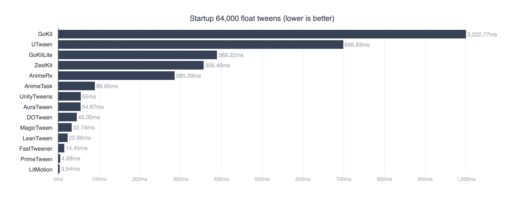
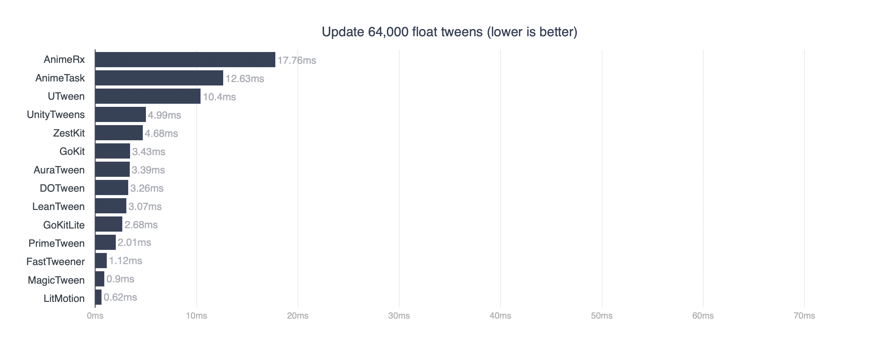
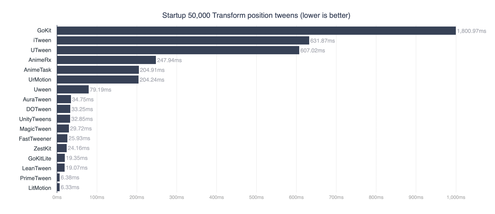
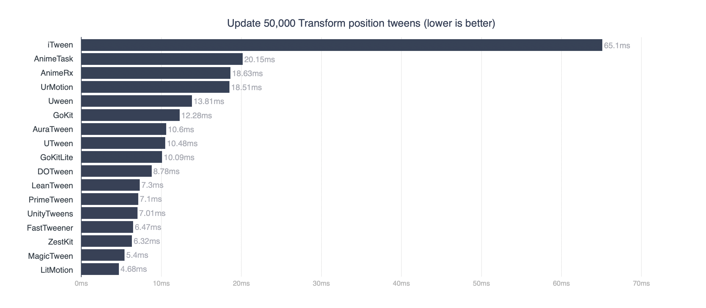
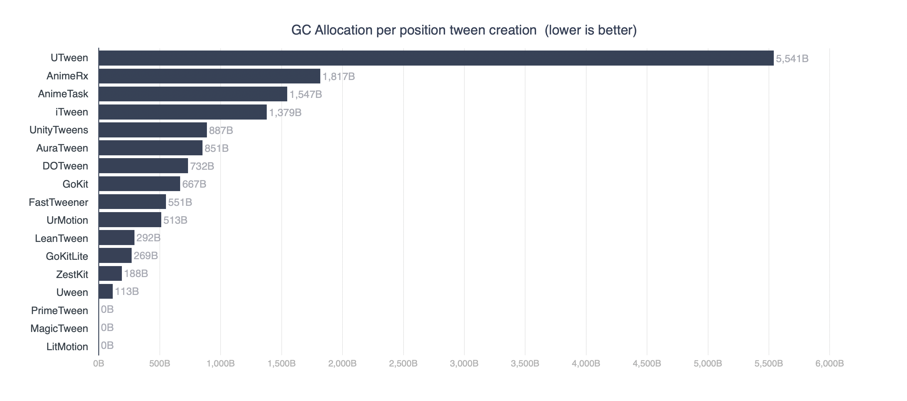

# TweenPerformance
 Performance comparison of Unity tween libraries

This repository measures the performance of tween libraries published on Github, Asset Store, etc. using the [Performance Testing API](https://docs.unity3d.com/Packages/com.unity.test-framework.performance@3.0/manual/index.html), and includes the results and the source code used.

> **Note**
> This repository does not contain the actual library source code, as it contains libraries that are not allowed to be redistributed. If you want to test yourself, please manually add the libraries required for testing.

## Testing Environment
Measurements were taken on builds for macOS.
Also, details regarding machines and versions are below.

<b>MacBook Pro</b>\
<b>OS:</b> macOS Ventura 13.0\
<b>CPU:</b> Apple M2\
<b>Memory:</b> 24GB

<b>Unity:</b> 2022.3.7f1\
<b>Scripting Backend:</b> IL2CPP

## Libraries

* [AuraTween](https://github.com/Auros/AuraTween) (1.1.1)
* [AnimeRx](https://github.com/kyubuns/AnimeRx) (1.3.2)
* [AnimeTask](https://github.com/kyubuns/AnimeTask) (1.13.1)
* [DOTween Pro](https://assetstore.unity.com/packages/tools/visual-scripting/dotween-pro-32416) (1.0.375)
* [FastTweener](https://github.com/Kovnir/FastTweener) (1.0.0)
* [GoKit](https://github.com/prime31/GoKit)
* [GoKitLite](https://github.com/prime31/GoKitLite)
* [iTween](https://assetstore.unity.com/packages/tools/animation/itween-84) (2.0.10)
* [LeanTween](https://assetstore.unity.com/packages/tools/animation/leantween-3595) (2.5.1)
* [LitMotion](https://github.com/AnnulusGames/LitMotion) (1.0.0)
* [MagicTween](https://github.com/AnnulusGames/MagicTween) (0.2.1)
* [PrimeTween](https://assetstore.unity.com/packages/tools/animation/primetween-high-performance-animations-and-sequences-252960) (1.1.5)
* [unity-tweens](https://github.com/jeffreylanters/unity-tweens) (3.2.0)
* [UrMotion](https://github.com/beinteractive/UrMotion) (1.0.0)
* [UTween](https://github.com/ls9512/UTween) (1.1.4)
* [Uween](https://github.com/beinteractive/Uween) (1.0.0)
* [ZestKit](https://github.com/prime31/ZestKit)

## Tween 64,000 float tweens

> **Note**
> Libraries that do not support tweening of custom properties are excluded from the benchmark.

### Startup

| Library | Time |
| - | - |
| GoKit | 3,322.77ms |
| UTween | 698.83ms |
| GoKitLite | 389.22ms |
| ZestKit | 356.49ms |
| AnimeRx | 285.29ms |
| AnimeTask | 89.65ms |
| UnityTweens | 55ms |
| AuraTween | 54.87ms |
| DOTween | 45.05ms |
| MagicTween | 32.74ms |
| LeanTween | 22.66ms |
| FastTweener | 14.45ms |
| PrimeTween | 4.68ms |
| LitMotion | 3.54ms |

### Update

| Library | Time |
| - | - |
| AnimeRx | 17.76ms |
| AnimeTask | 12.63ms |
| UTween | 10.4ms |
| UnityTweens | 4.99ms |
| ZestKit | 4.68ms |
| GoKit | 3.43ms |
| AuraTween | 3.39ms |
| DOTween | 3.26ms |
| LeanTween | 3.07ms |
| GoKitLite | 2.68ms |
| PrimeTween | 2.01ms |
| FastTweener | 1.12ms |
| MagicTween | 0.9ms |
| LitMotion | 0.62ms |

## Tween 50,000 transform.position

### Startup 

| Library | Time |
| - | - |
| GoKit | 1,800.97ms |
| iTween | 631.87ms |
| UTween | 607.02ms |
| AnimeRx | 247.94ms |
| AnimeTask | 204.91ms |
| UrMotion | 204.24ms |
| Uween | 79.19ms |
| AuraTween | 34.75ms |
| DOTween | 33.25ms |
| UnityTweens | 32.85ms |
| MagicTween | 29.72ms |
| FastTweener | 25.93ms |
| ZestKit | 24.16ms |
| GoKitLite | 19.35ms |
| LeanTween | 19.07ms |
| PrimeTween | 6.38ms |
| LitMotion | 6.33ms |

### Update

| Library | Time |
| - | - |
| iTween | 65.1ms |
| AnimeTask | 20.15ms |
| AnimeRx | 18.63ms |
| UrMotion | 18.51ms |
| Uween | 13.81ms |
| GoKit | 12.28ms |
| AuraTween | 10.6ms |
| UTween | 10.48ms |
| GoKitLite | 10.09ms |
| DOTween | 8.78ms |
| LeanTween | 7.3ms |
| PrimeTween | 7.1ms |
| UnityTweens | 7.01ms |
| FastTweener | 6.47ms |
| ZestKit | 6.32ms |
| MagicTween | 5.4ms |
| LitMotion | 4.68ms |

## GC Allocation

### Allocation per position tween creation

| Library | GC.Alloc |
| - | - |
| UTween | 5,541B |
| AnimeRx | 1,817B |
| AnimeTask | 1,547B |
| iTween | 1,379B |
| UnityTweens | 887B |
| AuraTween | 851B |
| DOTween | 732B |
| GoKit | 667B |
| FastTweener | 551B |
| UrMotion | 513B |
| LeanTween | 292B |
| GoKitLite | 269B |
| ZestKit | 188B |
| Uween | 113B |
| PrimeTween | 0B |
| MagicTween | 0B |
| LitMotion | 0B |